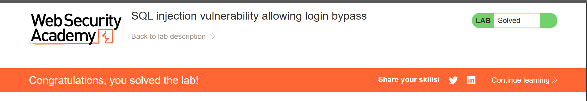
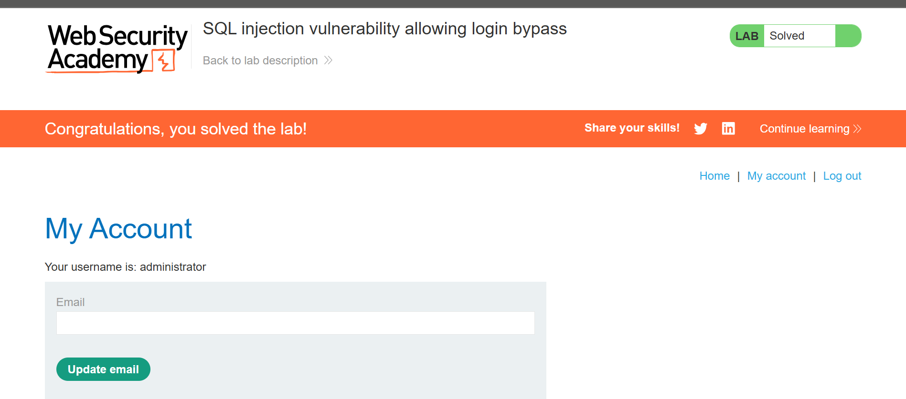

# Lab 2: SQL Injection Vulnerability Allowing Login Bypass

**Category:** SQL Injection
**Difficulty:** Apprentice
**Link:** https://portswigger.net/web-security/sql-injection

## Vulnerability
The login function builds a SQL query using unsanitized user input, 
likely structured like:

SELECT * FROM users WHERE username = 'INPUT' AND password = 'INPUT'
## Exploitation
By injecting a payload into the username field that comments out the 
rest of the query, the password check can be bypassed entirely.

**Payload used (username field):**

administrator'--
**Password field:**

(left blank)
## Result
The query becomes:
```sql
SELECT * FROM users WHERE username = 'administrator'--' AND password = ''
```
The `--` comments out the password check, so the application only 
verifies that a user named `administrator` exists, logging the attacker 
in without needing the correct password.

## Impact
An attacker can bypass authentication entirely and log in as any user, 
including high-privilege accounts like `administrator`, without knowing 
their password. This is a critical authentication bypass vulnerability.

## Remediation
Use parameterized queries (prepared statements) so user input is never 
directly concatenated into the SQL query, preventing comment injection 
and logic manipulation.

## Evidence


